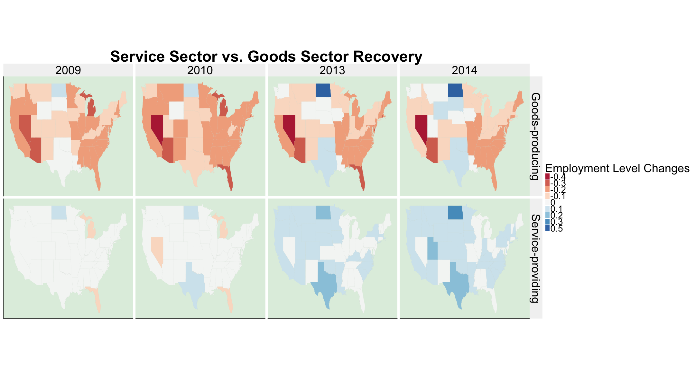
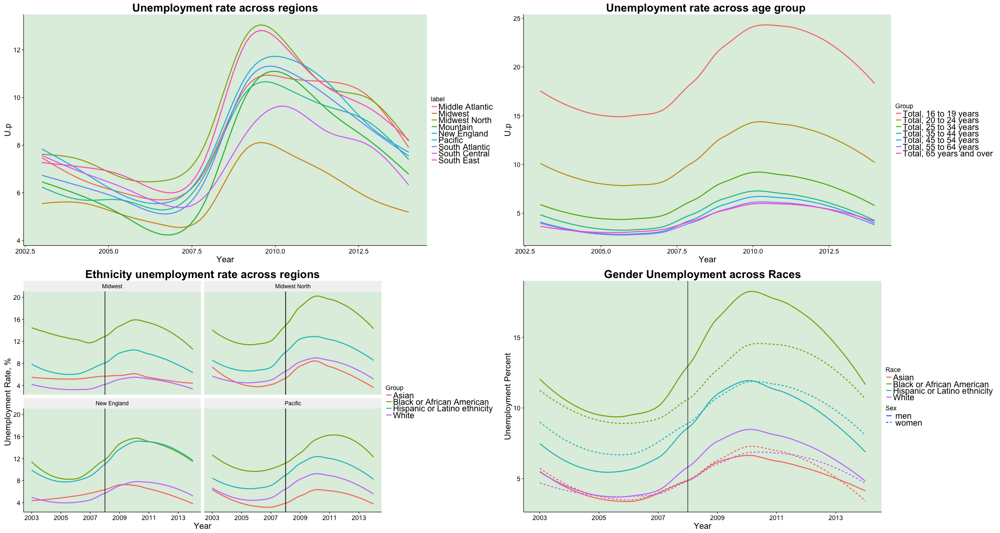

---
title       :
biglogo     : 
framework   : revealjs
revealjs    : {theme: solarized, transition=slide}
widgets     : []            # {mathjax, quiz, bootstrap}
mode        : selfcontained # {selfcontained, standalone, draft}
knit        : slidify::knit2slides
--- 


<a href='data:text/x-markdown;base64,LS0tCnRpdGxlICAgICAgIDoKYmlnbG9nbyAgICAgOiAKZnJhbWV3b3JrICAgOiByZXZlYWxqcwpyZXZlYWxqcyAgICA6IHt0aGVtZTogc29sYXJpemVkLCB0cmFuc2l0aW9uPXNsaWRlfQp3aWRnZXRzICAgICA6IFtdICAgICAgICAgICAgIyB7bWF0aGpheCwgcXVpeiwgYm9vdHN0cmFwfQptb2RlICAgICAgICA6IHNlbGZjb250YWluZWQgIyB7c2VsZmNvbnRhaW5lZCwgc3RhbmRhbG9uZSwgZHJhZnR9CmtuaXQgICAgICAgIDogc2xpZGlmeTo6a25pdDJzbGlkZXMKLS0tIAoKCmBgYHtyIHNldHVwLCBpbmNsdWRlPUZBTFNFfQoKa25pdHI6Om9wdHNfY2h1bmskc2V0KGVjaG8gPSBGQUxTRSkKCmxpYnJhcnkoRGF0YUNvbXB1dGluZykKbGlicmFyeShkcGx5cikKbGlicmFyeShnZ3Bsb3QyKQpsaWJyYXJ5KHRpZHlyKQpsaWJyYXJ5KGRldnRvb2xzKQpsaWJyYXJ5KGNvd3Bsb3QpCmxpYnJhcnkoZ2dtYXApCmxpYnJhcnkobWFwcykKbGlicmFyeShtYXBwcm9qKQpgYGAKCmBgYHtyLHJlc3VsdHM9J2FzaXMnLGVjaG89RkFMU0V9CgppbmNsdWRlU291cmNlRG9jdW1lbnRzKCkKYGBgCgoKIyMgVGhlIEltcGFjdCBvZiAyMDA4IEVjb25vbWljIENyaXNpcyBhY3Jvc3MgdGhlIFUuUy4KVGVhbSBDaXRyaXMgKFNvbmEsIEluZXMsIFNobywgSmFtaWUpCgoqIFdoaWNoIHNvY2lhbCBncm91cCB3YXMgbmVnYXRpdmVseSBhZmZlY3RlZCB0aGUgbW9zdCBhZnRlciAyMDA4IGNyaXNpcyBieSB1bmVtcGxveW1lbnQgcmF0ZQogIAoqIEJ1cmVhdSBvZiBMYWJvciBTdGF0aXN0aWNzIChCTFMpCiAgKyBEZW1vZ3JhcGhpYyBEYXRhCiAgICAoaHR0cDovL3d3dy5ibHMuZ292L2xhdS90YWJsZTE0ZnVsbCArIFllYXIgKGxhc3QgdHdvIGRpZ2l0cykgKyDigJwueGxzeOKAnSkKICArIEluZHVzdHJ5IERhdGEKICAgIChodHRwOi8vd3d3LmJscy5nb3YvY2V3L2RhdGF0b2MuaHRtKQoKKiBNYWluIFZhcmlhYmxlcyB0byBJbnZlc3RpZ2F0ZSAoMjAwNC0yMDE0KQogICsgVW5lbXBsb3ltZW50IFJhdGUKICArIEFnZSwgR2VuZGVyLCBFdGhuaWNpdHkKICArIEluZHVzdHJ5CiAgKyBSZWdpb24KICAKKiBNZXRob2RzCiAgKyBEYXRhIE1lcmdpbmc6IGZvciBsb29wcy9qb2luCiAgKyBEYXRhIENsZWFuaW5nIDpyZWdyZXgsZmlsdGVyLG11dGF0ZSxncmVwbCwgaWZlbHNlCiAgCgoKYGBge3IsIGVjaG89RkFMU0UsbWVzc2FnZT1GLCB3YXJuaW5nPUZ9CgpEZW1vZ3JhcGhpY3M8LSByZWFkLmNzdigifi9EZXNrdG9wL1RoZSBjaXRyaXMvRGVtb2dyYXBoaWNzLmNzdiIpCkRlbW9ncmFwaGljcy4zIDwtIHJlYWQuY3N2KCJ+L0Rlc2t0b3AvVGhlIGNpdHJpcy9EZW1vZ3JhcGhpY3NfMy5jc3YiKQpEZW1vZ3JhcGhpY3MuMyA8LSBEZW1vZ3JhcGhpY3MuM1ssLTFdCmRpdmlzaW9ubGFiZWxzIDwtIHJlYWQuY3N2KCJ+L0Rlc2t0b3AvVGhlIGNpdHJpcy9kaXZpc2lvbiBsYWJlbHMuY3N2IikKRGVtb2dyYXBoaWNzLjMgPC0gRGVtb2dyYXBoaWNzLjMgJT4lIGlubmVyX2pvaW4oZGl2aXNpb25sYWJlbHMpCkluZHVzdHJ5LmRhdGE8LSByZWFkLmNzdigifi9EZXNrdG9wL1RoZSBjaXRyaXMvSW5kdXN0cnkuY3N2IikKIyMtLS0tLS0tLS0tLS0tLS0tLS0tLS0tLS0tLS0tLS0tLS0tLS0tLS0tLS0tLS0tLS0tLS0tLS0tLS0tLS0tLQoKRXRobmljaXR5LkFnZSA9IERlbW9ncmFwaGljcyAlPiUgCiAgZmlsdGVyKGdyZXBsKCJbeWVhcnN8b3Zlcl0kIiwgR3JvdXApKSAlPiUgCiAgZmlsdGVyKGdyZXBsKCJeSGlzcGFuaWMiLCBHcm91cCkgfCBncmVwbCgiXldoaXRlIiwgR3JvdXApIHwgZ3JlcGwoIl5CbGFjayBvciBBZnJpY2FuIEFtZXJpY2FuIiwgR3JvdXApKSAgJT4lIAogIGZpbHRlcihHcm91cCE9Ikhpc3BhbmljIG9yIExhdGlubyBldGhuaWNpdHkiICYgR3JvdXAhPSJXaGl0ZSIgJiBHcm91cCE9IkJsYWNrIG9yIEFmcmljYW4gQW1lcmljYW4iKQoKRXRobmljaXR5LkFnZT0gRXRobmljaXR5LkFnZSAlPiUgbXV0YXRlKFJhY2UgPSBpZmVsc2UoZ3JlcGwoIl5IaXNwYW5pYyIsIEdyb3VwKSwgIkhpc3BhbmljIiwgCiAgaWZlbHNlKGdyZXBsKCJeV2hpdGUiLCBHcm91cCksICJXaGl0ZSIsICJCbGFjayIpKQogICAgICAgICAgICAgICAgICAgICAgICAgICAgKQoKRXRobmljaXR5LkFnZSA9IEV0aG5pY2l0eS5BZ2UgJT4lICAKICBtdXRhdGUoQWdlX0dyb3VwID0gCiAgICAgICAgICAgaWZlbHNlKGdyZXBsKCJvdmVyJCIsIEdyb3VwKSwgIjY1IHllYXJzIGFuZCBvdmVyIiwKICAgICAgICAgICAgICAgICAgICAgICAgICAgICAgaWZlbHNlIChncmVwbCgiNjQgeWVhcnMkIiwgR3JvdXApLCAiNTUgdG8gNjQgeWVhcnMiLAogICAgICAgICAgICAgICAgICAgICAgICAgICAgICAgIGlmZWxzZShncmVwbCgiNTQgeWVhcnMkIiwgR3JvdXApLCAiNDUgdG8gNTQgeWVhcnMiLAogICAgICAgICAgICAgICAgICAgICAgICAgICAgICAgICAgaWZlbHNlKGdyZXBsKCI0NCB5ZWFycyQiLCBHcm91cCksICIzNSB0byA0NCB5ZWFycyIsCiAgICAgICAgICAgICAgICAgICAgICAgICAgICAgICAgICAgIGlmZWxzZShncmVwbCgiMzQgeWVhcnMkIiwgR3JvdXApLCAiMjUgdG8gMzQgeWVhcnMiLAogICAgICAgICAgICAgICAgICAgICAgICAgICAgICAgICAgICAgaWZlbHNlKGdyZXBsKCIyNCB5ZWFycyQiLCBHcm91cCksICIyMCB0byAyNCB5ZWFycyIsICIxNiB0byAxOSB5ZWFycyIpCiAgICAgICAgICAgICAgICAgICAgICAgICAgICAgICAgICAgICkKICAgICAgICAgICAgICAgICAgICAgICAgICAgICAgICAgICkKICAgICAgICAgICAgICAgICAgICAgICAgICAgICAgICApCiAgICAgICAgICAgICAgICAgICAgICAgICAgICAgICkKICAgICAgICAgICAgKQogICkKCkV0aG5pY2l0eS5BZ2U9IEV0aG5pY2l0eS5BZ2UlPiUgbXV0YXRlKEFnZV9Hcm91cD1mYWN0b3IoQWdlX0dyb3VwLCBvcmRlcmVkPVRSVUUpKSAKCkV0aG5pY2l0eS5BZ2UgPSBEZW1vZ3JhcGhpY3MgJT4lIGZpbHRlcihncmVwbCgiW3llYXJzfG92ZXJdJCIsIEdyb3VwKSkKCkV0aG5pY2l0eS5BZ2U9IEV0aG5pY2l0eS5BZ2UgJT4lIG11dGF0ZShSYWNlID0gaWZlbHNlKGdyZXBsKCJeSGlzcGFuaWMiLCBHcm91cCksICJIaXNwYW5pYyIsIGlmZWxzZShncmVwbCgiXldoaXRlIiwgR3JvdXApLCAiV2hpdGUiLCAiQmxhY2siKSkpCmBgYAoKCgpgYGB7cixlY2hvPUZBTFNFfQpTZXguQWdlID0gRGVtb2dyYXBoaWNzICAlPiUgCiAgZmlsdGVyKGdyZXBsKCJbeWVhcnN8b3Zlcl0kIiwgR3JvdXApKSAlPiUgCiAgZmlsdGVyKGdyZXBsKCJeV29tZW4iLCBHcm91cCkgfCBncmVwbCgiXk1lbiIsIEdyb3VwKSkgICU+JSAKICBmaWx0ZXIoR3JvdXAhPSJXb21lbiIgJiBHcm91cCE9Ik1lbiIpCgpTZXguQWdlPSBTZXguQWdlICU+JSBtdXRhdGUoUmFjZSA9IGlmZWxzZShncmVwbCgiXldvbWVuIiwgR3JvdXApLCAiV29tZW4iLCAiTWVuIikpCgpTZXguQWdlID0gU2V4LkFnZSAlPiUgIAogIG11dGF0ZShBZ2VfR3JvdXAgPSAKICAgICAgICAgICBpZmVsc2UoZ3JlcGwoIm92ZXIkIiwgR3JvdXApLCAiNjUgeWVhcnMgYW5kIG92ZXIiLAogICAgICAgICAgICAgICAgICAgICAgICAgICAgICBpZmVsc2UgKGdyZXBsKCI2NCB5ZWFycyQiLCBHcm91cCksICI1NSB0byA2NCB5ZWFycyIsCiAgICAgICAgICAgICAgICAgICAgICAgICAgICAgIGlmZWxzZShncmVwbCgiNTQgeWVhcnMkIiwgR3JvdXApLCAiNDUgdG8gNTQgeWVhcnMiLAogICAgICAgICAgICAgICAgICAgICAgICAgICAgICAgICAgaWZlbHNlKGdyZXBsKCI0NCB5ZWFycyQiLCBHcm91cCksICIzNSB0byA0NCB5ZWFycyIsCiAgICAgICAgICAgICAgICAgICAgICAgICAgICAgICAgICAgIGlmZWxzZShncmVwbCgiMzQgeWVhcnMkIiwgR3JvdXApLCAiMjUgdG8gMzQgeWVhcnMiLAogICAgICAgICAgICAgICAgICAgICAgICAgICAgICAgICAgICAgIGlmZWxzZShncmVwbCgiMjQgeWVhcnMkIiwgR3JvdXApLCAiMjAgdG8gMjQgeWVhcnMiLCAiMTYgdG8gMTkgeWVhcnMiKQogICAgICAgICAgICAgICAgICAgICAgICAgICAgICAgICAgICApCiAgICAgICAgICAgICAgICAgICAgICAgICAgICAgICAgICApCiAgICAgICAgICAgICAgICAgICAgICAgICAgICAgICAgKQogICAgICAgICAgICAgICAgICAgICAgICAgICAgICApCiAgICAgICAgICAgICkKICApCgpTZXguQWdlID0gU2V4LkFnZSAlPiUgbXV0YXRlKEFnZV9Hcm91cD1mYWN0b3IoQWdlX0dyb3VwLCBvcmRlcmVkPVRSVUUpKQoKYGBgCgpgYGB7cixlY2hvPUZBTFNFLGZpZy53aWR0aD0xOCwgZmlnLmhlaWdodD03fQpoZWFkKEluZHVzdHJ5LmRhdGEsNSkKYGBgCgotLS0KIyMgQW5hbHlzaXMgb24gRW1wbG95bWVudCBsZXZlbC0gUmVnaW9uL0luZHVzdHJ5CgpgYGB7cixlY2hvPUZBTFNFLGZpZy5oZWlnaHQ9MTYsZmlnLndpZHRoPTMwfQpJbmR1c3RyeS5kYXRhMSA9IHJlYWQuY3N2KCJ+L0Rlc2t0b3AvVGhlIGNpdHJpcy9JbmR1c3RyeV9BbGxfU3RhdGVzLmNzdiIpCkluZHVzdHJ5LmRhdGExID0gSW5kdXN0cnkuZGF0YTEgJT4lIG11dGF0ZShTdGF0ZSA9IHRvbG93ZXIoU3RhdGUpKSAlPiUgCiAgc2VwYXJhdGUoU3RhdGUsIGludG89YygiU3RhdGUiLCAiTm90Lk5lZWRlZCIpLCBzZXA9Ii0tIikgJT4lIAogIHNlbGVjdCgtTm90Lk5lZWRlZCkgJT4lIAogIG11dGF0ZShTdGF0ZSA9IHRyaW13cyhTdGF0ZSkpClN0YXRlX21hcCA9IG1hcF9kYXRhKG1hcD0ic3RhdGUiKQoKIzIwMDkgcGxvdHMKZGF0YSA9IEluZHVzdHJ5LmRhdGExICU+JSBmaWx0ZXIoWWVhciA+IDIwMDgpICU+JSAKICBtdXRhdGUoRW1wTHZsLmNoYW5nZT0gaWZlbHNlKEVtcEx2bC5jaGFuZ2UgPCAtMC41LCAtMC41LCAKICAgICAgICAgICAgICAgICAgICAgICAgICAgICAgIGlmZWxzZShFbXBMdmwuY2hhbmdlPjAuNSwgIDAuNSwgRW1wTHZsLmNoYW5nZSkpKSAlPiUgCiAgbXV0YXRlKEVtcEx2bC5jaGFuZ2U9IHJvdW5kKEVtcEx2bC5jaGFuZ2UsIGRpZ2l0cz0xKSkgJT4lIAogIG11dGF0ZShFbXBMdmwuY2hhbmdlPSBmYWN0b3IoRW1wTHZsLmNoYW5nZSwgb3JkZXJlZD1UUlVFKSkgCgptYXA2ID0gU3RhdGVfbWFwICU+JSBpbm5lcl9qb2luKGRhdGEgJT4lIGZpbHRlcihJbmR1c3RyeT09Ik1hbnVmYWN0dXJpbmcifEluZHVzdHJ5PT0iQ29uc3RydWN0aW9uIiksIGJ5PWMoInJlZ2lvbiI9IlN0YXRlIikpCm1hcDYgJT4lIGZpbHRlcihZZWFyPT0yMDEwfFllYXI9PTIwMDl8WWVhcj09MjAxNHxZZWFyPT0yMDEzKSAlPiUgCiAgZ2dwbG90KGFlcyh4PWxvbmcseT1sYXQsZ3JvdXA9Z3JvdXApKSArICAgIyB1c2UgbWFwX2RhdGEKICBnZW9tX3BvbHlnb24oYWVzKGZpbGw9RW1wTHZsLmNoYW5nZSksY29sb3I9TkEsIGFscGhhPTAuOSkgKyAgICAgICAgICAjIGFkZCBmaWxsIGNvbG9yCiAgZ2VvbV9wYXRoKGNvbG9yPSJncmV5IixzaXplPS4xLGFscGhhPS4yKSArIGNvb3JkX21hcCgicG9seWNvbmljIikgKyAKICBnZ3RpdGxlKCJNYW51ZmFjdHVyaW5nIFZzLiBDb25zdHJ1Y3Rpb24gUmVjb3ZlcnkiKSsgCiAgc2NhbGVfZmlsbF9icmV3ZXIodHlwZT0iZGl2IixwYWxldHRlPSJSZEJ1IixuYW1lPSJFbXBsb3ltZW50IGxldmVsIGNoYW5nZSIpKyAKICBmYWNldF9ncmlkKEluZHVzdHJ5flllYXIpK2Nvb3JkX2ZpeGVkKHJhdGlvPTIuMikrdGhlbWUoYXhpcy50ZXh0Lng9ZWxlbWVudF9ibGFuaygpLGF4aXMudGV4dC55PWVsZW1lbnRfYmxhbmsoKSxheGlzLnRpdGxlLng9ZWxlbWVudF9ibGFuaygpLCBheGlzLnRpdGxlLnk9ZWxlbWVudF9ibGFuaygpLCBheGlzLnRpY2tzPWVsZW1lbnRfYmxhbmsoKSkrIHRoZW1lKAogIHBhbmVsLmJhY2tncm91bmQgPSBlbGVtZW50X3JlY3QoZmlsbCA9ICJob25leWRldzIiKSwgc3RyaXAuYmFja2dyb3VuZCA9IGVsZW1lbnRfcmVjdChmaWxsID0gImdyYXk5NSIsIHNpemUgPSAyKSxwbG90LnRpdGxlID0gZWxlbWVudF90ZXh0KHNpemU9NDgpLGF4aXMudGl0bGU9ZWxlbWVudF90ZXh0KHNpemU9MzYpLGF4aXMudGV4dD1lbGVtZW50X3RleHQoc2l6ZT0zNiksbGVnZW5kLnRpdGxlPWVsZW1lbnRfdGV4dChzaXplPTM2KSxsZWdlbmQudGV4dD1lbGVtZW50X3RleHQoc2l6ZT0yOCkpK3RoZW1lKHN0cmlwLnRleHQ9IGVsZW1lbnRfdGV4dChzaXplID0gMzYpKQoKYGBgCgpgYGB7cixlY2hvPUZBTFNFfQoKdGhlbWU8LSB0aGVtZSgKICBwYW5lbC5iYWNrZ3JvdW5kID0gZWxlbWVudF9yZWN0KGZpbGwgPSAiaG9uZXlkZXcyIiksIHN0cmlwLmJhY2tncm91bmQgPSBlbGVtZW50X3JlY3QoZmlsbCA9ICJncmF5OTUiLCBzaXplID0gMikscGxvdC50aXRsZSA9IGVsZW1lbnRfdGV4dChzaXplPTI0KSxheGlzLnRpdGxlPWVsZW1lbnRfdGV4dChzaXplPTE4KSxheGlzLnRleHQ9ZWxlbWVudF90ZXh0KHNpemU9MTQpLGxlZ2VuZC50ZXh0PWVsZW1lbnRfdGV4dChzaXplPTE4KSkKCnRoZW1lIDwtIHRoZW1lICsgdGhlbWUoc3RyaXAudGV4dC54ID0gZWxlbWVudF90ZXh0KHNpemUgPSAxMikpCmBgYAoKCi0tLQoKIyMgV2hpY2ggZGVtb2dyYXBoaWMgZ3JvdXAgd2FzIG5lZ2F0aXZlbHkgYWZmZWN0ZWQgdGhlIG1vc3Q/ICAgICAgIAojIyBpbiB3aGljaCByZWdpb24/IApgYGB7cixlY2hvPUZBTFNFLGZpZy5oZWlnaHQ9MTYsZmlnLndpZHRoPTMwfQoKbmV3X2FnZSA8LSBEZW1vZ3JhcGhpY3MgJT4lIGZpbHRlcihHcm91cD09IlRvdGFsLCAxNiB0byAxOSB5ZWFycyJ8R3JvdXA9PSJUb3RhbCwgMjAgdG8gMjQgeWVhcnMifEdyb3VwPT0iVG90YWwsIDI1IHRvIDM0IHllYXJzInxHcm91cD09IlRvdGFsLCAzNSB0byA0NCB5ZWFycyJ8R3JvdXA9PSJUb3RhbCwgNDUgdG8gNTQgeWVhcnMifEdyb3VwPT0iVG90YWwsIDU1IHRvIDY0IHllYXJzInxHcm91cD09IlRvdGFsLCA2NSB5ZWFycyBhbmQgb3ZlciIpCgpQMTwtZ2dwbG90KG5ld19hZ2UsYWVzKHg9WWVhcix5PVUucCxjb2w9R3JvdXApKStnZW9tX3Ntb290aChzZT1GQUxTRSkrdGhlbWUrZ2d0aXRsZSgiVW5lbXBsb3ltZW50IHJhdGUgYWNyb3NzIGFnZSBncm91cCAiKQoKIy0tLS0tLS0tLS0tLS0tLS0tLS0tLS0tLS0tCgphZ2VfZ3JhcGhfQ0FNSU5ZIDwtIERlbW9ncmFwaGljcy4zICU+JSBmaWx0ZXIobGFiZWw9PSJQYWNpZmljInxsYWJlbD09Ik1pZHdlc3QifGxhYmVsPT0iTWlkd2VzdCBOb3J0aCJ8bGFiZWw9PSJOZXcgRW5nbGFuZCIpICU+JSBmaWx0ZXIoR3JvdXA9PSJUb3RhbCwgMTYgdG8gMTkgeWVhcnMifEdyb3VwPT0iVG90YWwsIDIwIHRvIDI0IHllYXJzInxHcm91cD09IlRvdGFsLCAyNSB0byAzNCB5ZWFycyJ8R3JvdXA9PSJUb3RhbCwgMzUgdG8gNDQgeWVhcnMifEdyb3VwPT0iVG90YWwsIDQ1IHRvIDU0IHllYXJzInxHcm91cD09IlRvdGFsLCA1NSB0byA2NCB5ZWFycyJ8R3JvdXA9PSJUb3RhbCwgNjUgeWVhcnMgYW5kIG92ZXIiKQoKUDIgPC0gZ2dwbG90KGFnZV9ncmFwaF9DQU1JTlksYWVzKHg9WWVhcix5PVUucCxjb2w9R3JvdXApKSArIGdlb21fc21vb3RoKHNlPUZBTFNFKSArZmFjZXRfd3JhcCh+bGFiZWwpK2dndGl0bGUoIkFnZSB1bmVtcGxveW1lbnQgcmF0ZSBhY3Jvc3MgcmVnaW9ucyIpKyB0aGVtZSArc2NhbGVfeF9jb250aW51b3VzKGJyZWFrcz1jKDIwMDMsMjAwNSwyMDA3LDIwMDksMjAxMSwyMDEzKSkrc2NhbGVfeV9jb250aW51b3VzKGJyZWFrcz1jKDQsOCwxMiwxNiwyMCwyNCkpKyBnZW9tX3ZsaW5lKHhpbnRlcmNlcHQgPSAyMDA4KSsgdGhlbWUobGVnZW5kLnBvc2l0aW9uPSJub25lIikKCiMtLS0tLS0tLS0tLS0tLS0tLS0tLS0tLS0tLQoKY29sbmFtZXMoU2V4LkFnZSlbY29sbmFtZXMoU2V4LkFnZSk9PSJSYWNlIl0gPC0gIlNleCIKClAzIDwtIFNleC5BZ2UgJT4lIGdncGxvdChhZXMoeD1ZZWFyLHk9VS5wLGNvbD1BZ2VfR3JvdXApKStnZW9tX3Ntb290aChzZT1GQUxTRSkrZmFjZXRfZ3JpZCh+U2V4KSsgdGhlbWUrIHRoZW1lKGxlZ2VuZC5wb3NpdGlvbj0ibm9uZSIpK2dndGl0bGUoIlRoZSBhZ2UgdW5lbXBsb3ltZW50IHJhdGUgYWNyb3NzIHNleCIpK3RoZW1lKGxlZ2VuZC5wb3NpdGlvbj0ibm9uZSIpCgojLS0tLS0tLS0tLS0tLS0tLS0tLS0tLS0tCgphbGxfcmFjZXMgPC0gRGVtb2dyYXBoaWNzICU+JSBmaWx0ZXIoR3JvdXAgPT0gIk1lbiIgfCBHcm91cCA9PSAiV29tZW4iKQoKUDQgPC0gIGdncGxvdChhbGxfcmFjZXMsYWVzKHggPSBZZWFyLCB5ID0gVS5wLCBjb2wgPSBHcm91cCkpICsgZ2VvbV9zbW9vdGgoc2UgPSBGQUxTRSkgKyB5bGFiKCJVbmVtcGxveW1lbnQgUGVyY2VudCIpICsgZ2d0aXRsZSgiVW5lbXBsb3ltZW50IHJhdGUgYWNyb3NzIGdlbmRlciBncm91cCIpICsgdGhlbWUgICsgZ2VvbV92bGluZSh4aW50ZXJjZXB0ID0gMjAwOCkgKyBzY2FsZV94X2NvbnRpbnVvdXMoYnJlYWtzID0gYygyMDAzLCAyMDA1LCAyMDA3LCAyMDA5LCAyMDExLCAyMDEzKSkKCiMtLS0tLS0tLS0tLS0tLS0tLS0tLS0tLS0KCmdlbmRlcl9hY3Jvc3NfcmFjZXNfZmFjZXQgPC0gRGVtb2dyYXBoaWNzICU+JSBmaWx0ZXIoR3JvdXAgPT0gIkJsYWNrIG9yIEFmcmljYW4gQW1lcmljYW4sIG1lbiIgfCBHcm91cCA9PSAiQmxhY2sgb3IgQWZyaWNhbiBBbWVyaWNhbiwgd29tZW4iIHwgR3JvdXAgPT0gIkhpc3BhbmljIG9yIExhdGlubyBldGhuaWNpdHksIG1lbiIgfCBHcm91cCA9PSAiSGlzcGFuaWMgb3IgTGF0aW5vIGV0aG5pY2l0eSwgd29tZW4iIHwgR3JvdXAgPT0gIldoaXRlLCBtZW4iIHwgR3JvdXAgPT0gIldoaXRlLCB3b21lbiIgfCBHcm91cCA9PSAiQXNpYW4sIG1lbiIgfCBHcm91cCA9PSAiQXNpYW4sIHdvbWVuIikKClA1IDwtICBnZ3Bsb3QoZ2VuZGVyX2Fjcm9zc19yYWNlc19mYWNldCxhZXMoeCA9IFllYXIsIHkgPSBVLnAsIGNvbCA9IEdyb3VwKSkgKyBnZW9tX3Ntb290aCggc2UgPSBGQUxTRSkgKyB5bGFiKCJVbmVtcGxveW1lbnQgUGVyY2VudCIpICsgZ2d0aXRsZSgiR2VuZGVyIFVuZW1wbG95bWVudCBhY3Jvc3MgUmFjZXMiKSAgKyB0aGVtZSAgKyBnZW9tX3ZsaW5lKHhpbnRlcmNlcHQgPSAyMDA4KSArIHNjYWxlX3hfY29udGludW91cyhicmVha3MgPSBjKDIwMDMsIDIwMDUsIDIwMDcsIDIwMDksIDIwMTEsIDIwMTMpKSt0aGVtZShsZWdlbmQucG9zaXRpb249Im5vbmUiKQoKCiMtLS0tLS0tLS0tLS0tLS0tLS0tCgpnZW5kZXJfYWNyb3NzX3JlZ2lvbl9mYWNldCA8LSBEZW1vZ3JhcGhpY3MuMyAlPiUgZmlsdGVyKEdyb3VwID09ICJNZW4iIHwgR3JvdXAgPT0gIldvbWVuIikgJT4lIGZpbHRlcihsYWJlbCA9PSAiTWlkd2VzdCBOb3J0aCIgfCBsYWJlbCA9PSAiTWlkd2VzdCIgfCBsYWJlbCA9PSAiUGFjaWZpYyIgfCBsYWJlbCA9PSAiTmV3IEVuZ2xhbmQiKQoKUDYgPC0gIGdncGxvdChnZW5kZXJfYWNyb3NzX3JlZ2lvbl9mYWNldCxhZXMoeCA9IFllYXIsIHkgPSBVLnAsIGNvbCA9IEdyb3VwKSkgKyBnZW9tX3Ntb290aChzZT1GQUxTRSkgKyB5bGFiKCJVbmVtcGxveW1lbnQgUGVyY2VudCIpICsgZ2d0aXRsZSgiR2VuZGVyIHVuZW1wbG95bWVudCByYXRlIGFjcm9zcyByZWdpb25zIikgKyBmYWNldF93cmFwKH4gbGFiZWwpICsgc2NhbGVfeF9jb250aW51b3VzKGJyZWFrcyA9IGMoMjAwMywgMjAwNSwgMjAwNywgMjAwOSwgMjAxMSwgMjAxMykpICsgZ2VvbV92bGluZSh4aW50ZXJjZXB0ID0gMjAwOCkgKyB0aGVtZSt0aGVtZShsZWdlbmQucG9zaXRpb249Im5vbmUiKQoKIy0tLS0tLS0tLS0tLS0tLS0tLS0tLS0KTmV3X0V0aG5pY2l0eSA8LSBEZW1vZ3JhcGhpY3MuMyAlPiUKCmZpbHRlcihHcm91cD09IkJsYWNrIG9yIEFmcmljYW4gQW1lcmljYW4ifEdyb3VwPT0iSGlzcGFuaWMgb3IgTGF0aW5vIGV0aG5pY2l0eSIgfAoKR3JvdXA9PSJXaGl0ZSJ8IEdyb3VwPT0iQXNpYW4iKQoKUDcgPC0gZ2dwbG90KE5ld19FdGhuaWNpdHksYWVzKHg9WWVhcix5PVUucCkpK2dlb21fc21vb3RoKGFlcyhjb2w9R3JvdXApLHNlPUZBTFNFKSsgZ2d0aXRsZSgiVW5lbXBsb3ltZW50IHJhdGUgYWNyb3NzIGV0aG5pY2l0eSBncm91cCIpK2dlb21fdmxpbmUoeGludGVyY2VwdCA9IDIwMDgpK3lsYWIoIlVuZW1wbG95bWVudCBSYXRlLCAlIikgKyB4bGFiKCJZZWFyIikgKyBzY2FsZV94X2NvbnRpbnVvdXMoYnJlYWtzPWMoMjAwMywyMDA1LDIwMDcsMjAwOSwyMDExLDIwMTMpKStzY2FsZV95X2NvbnRpbnVvdXMoYnJlYWtzPWMoNCw4LDEyLDE2LDIwLDI0KSkrIGdlb21fdmxpbmUoeGludGVyY2VwdCA9IDIwMDgpK3RoZW1lCiMtLS0tLS0tLS0tLS0tLS0tLQoKUDg8LSBOZXdfRXRobmljaXR5ICU+JSBmaWx0ZXIobGFiZWw9PSJOZXcgRW5nbGFuZCJ8bGFiZWw9PSJQYWNpZmljInxsYWJlbD09Ik1pZHdlc3QifGxhYmVsPT0iTWlkd2VzdCBOb3J0aCIpICU+JWdncGxvdChhZXMoeD1ZZWFyLHk9VS5wKSkrZ2VvbV9zbW9vdGgoYWVzKGNvbD1Hcm91cCksc2U9RkFMU0UpK2ZhY2V0X3dyYXAofmxhYmVsKStnZ3RpdGxlKCJFdGhuaWNpdHkgdW5lbXBsb3ltZW50IHJhdGUgYWNyb3NzIHJlZ2lvbnMiKSArIGdlb21fdmxpbmUoeGludGVyY2VwdCA9IDIwMDgpK3lsYWIoIlVuZW1wbG95bWVudCBSYXRlLCAlIikgKyB4bGFiKCJZZWFyIikgKyBzY2FsZV94X2NvbnRpbnVvdXMoYnJlYWtzPWMoMjAwMywyMDA1LDIwMDcsMjAwOSwyMDExLDIwMTMpKStzY2FsZV95X2NvbnRpbnVvdXMoYnJlYWtzPWMoNCw4LDEyLDE2LDIwLDI0KSkrIGdlb21fdmxpbmUoeGludGVyY2VwdCA9IDIwMDgpK3RoZW1lCiMtLS0tLS0tLS0tLS0tLS0KClA5IDwtIEV0aG5pY2l0eS5BZ2UgJT4lIGZpbHRlcihHcm91cD09IldoaXRlLCAyMCB0byAyNCB5ZWFycyJ8IEdyb3VwPT0iQmxhY2sgb3IgQWZyaWNhbiBBbWVyaWNhbiwgMjAgdG8gMjQgeWVhcnMifEdyb3VwPT0iSGlzcGFuaWMgb3IgTGF0aW5vIGV0aG5pY2l0eSwgMjAgdG8gMjQgeWVhcnMiKSAlPiUgIGdncGxvdChhZXMoeD1ZZWFyLHk9VS5wLGNvbD1Hcm91cCkpK2dlb21fc21vb3RoKHNlPUZBTFNFKSt4bGFiKCJZZWFyIikreWxhYigiVW5lbXBsb3ltZW50IFJhdGUiKStnZ3RpdGxlKCJFdGhuaWNpdHkgVW5lbXBsb3ltZW50IGFjcm9zcyBBZ2UsIDIwLTI0IikgK3lsYWIoIlVuZW1wbG95bWVudCBSYXRlLCAlIikgKyB4bGFiKCJZZWFyIikgKyBzY2FsZV94X2NvbnRpbnVvdXMoYnJlYWtzPWMoMjAwMywyMDA1LDIwMDcsMjAwOSwyMDExLDIwMTMpKStzY2FsZV95X2NvbnRpbnVvdXMoYnJlYWtzPWMoNCw4LDEyLDE2LDIwLDI0KSkrIGdlb21fdmxpbmUoeGludGVyY2VwdCA9IDIwMDgpKyB0aGVtZSAKIy0tLS0tLS0tLS0tLS0tLQoKUDEwPC0gRGVtb2dyYXBoaWNzLjMgJT4lIGdncGxvdChhZXMoeD1ZZWFyLHk9VS5wKSkrIGdlb21fc21vb3RoKGFlcyhjb2w9bGFiZWwpLHNlPUZBTFNFKSsgdGhlbWUgK2dndGl0bGUoIlVuZW1wbG95bWVudCByYXRlIGFjcm9zcyByZWdpb25zIikKCnBsb3RfZ3JpZChQMTAsUDcsUDgsUDksIG5jb2wgPSAyLCBucm93ID0gMikKCgoKYGBgCgoKCg==' target='_blank' title='User  at /Users/Ines_Kim' download='index.Rmd'> &#8658; index.Rmd</a>  


## The Impact of 2008 Economic Crisis across the U.S.
Team Citris (Sona, Ines, Sho, Jamie)

* Which social group was negatively affected the most after 2008 crisis by unemployment rate
  
* Bureau of Labor Statistics (BLS)
  + Demographic Data
    (http://www.bls.gov/lau/table14full + Year (last two digits) + “.xlsx”)
  + Industry Data
    (http://www.bls.gov/cew/datatoc.htm)

* Main Variables to Investigate (2004-2014)
  + Unemployment Rate
  + Age, Gender, Ethnicity
  + Industry
  + Region
  
* Methods
  + Data Merging: for loops/join
  + Data Cleaning :regrex,filter,mutate,grepl, ifelse
  


```
##   Year                   State              Industry Avg.EmpLvl Avg.Pay
## 1 2014 California -- Statewide Total, all industries   15809082   59042
## 2 2007 California -- Statewide Total, all industries   15640575   50538
## 3 2006 California -- Statewide Total, all industries   15503144   48345
## 4 2008 California -- Statewide Total, all industries   15494915   51487
## 5 2013 California -- Statewide Total, all industries   15378962   57111
##   Pre.Recession.EmpLvl EmpLvl.change
## 1             15332732   0.031067506
## 2             15332732   0.020077488
## 3             15332732   0.011114245
## 4             15332732   0.010577551
## 5             15332732   0.003015102
```

---
## Analysis on Employment level- Region/Industry




---

## Which demographic group was negatively affected the most?       
## in which region? 



