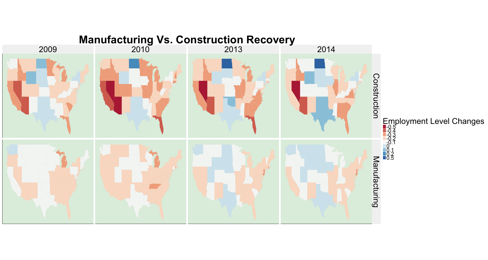

---
title       :
biglogo     : 
framework   : revealjs
revealjs    : {theme: solarized, transition=slide}
widgets     : []            # {mathjax, quiz, bootstrap}
mode        : selfcontained # {selfcontained, standalone, draft}
knit        : slidify::knit2slides
--- 


## The Impact of 2008 Economic Crisis across the U.S.
Team Citris (Sona, Ines, Sho, Jamie)

* Which social group was negatively affected the most after 2008 crisis by unemployment rate
  
* Bureau of Labor Statistics (BLS)
  + Demographic Data
    (http://www.bls.gov/lau/table14full + Year (last two digits) + “.xlsx”)
  + Industry Data
    (http://www.bls.gov/cew/datatoc.htm)

* Main Variables to Investigate (2004-2014)
  + Unemployment Rate
  + Age, Gender, Ethnicity
  + Industry
  + Region
  
* Methods
  + Data Merging: for loops/join
  + Data Cleaning :regrex,filter,mutate,grepl, ifelse
  

```r
for (year in 1:11){for (i in 1:nrow(area_codes)){
  state = area_codes[i, 2]
  filename = paste("industry/", state, " ", years[year],".csv", sep = "")
  data = read.file(filename)result = rbind(result, data) }}
    
Industry.data = Industry.data %>% left_join(Pre.Recession)

Ethnicity.Age = Demographics %>% filter(grepl("[years|over]$", Group))

Ethnicity.Age= Ethnicity.Age %>% mutate(Race = ifelse(grepl("^Hispanic", Group), "Hispanic", ifelse(grepl("^White", Group), "White", "Black")))
```

---

## Analysis on Unemployment Rate-Region/Industry




---

## Which demographic group was negatively affected the most?       
## in which region? 


